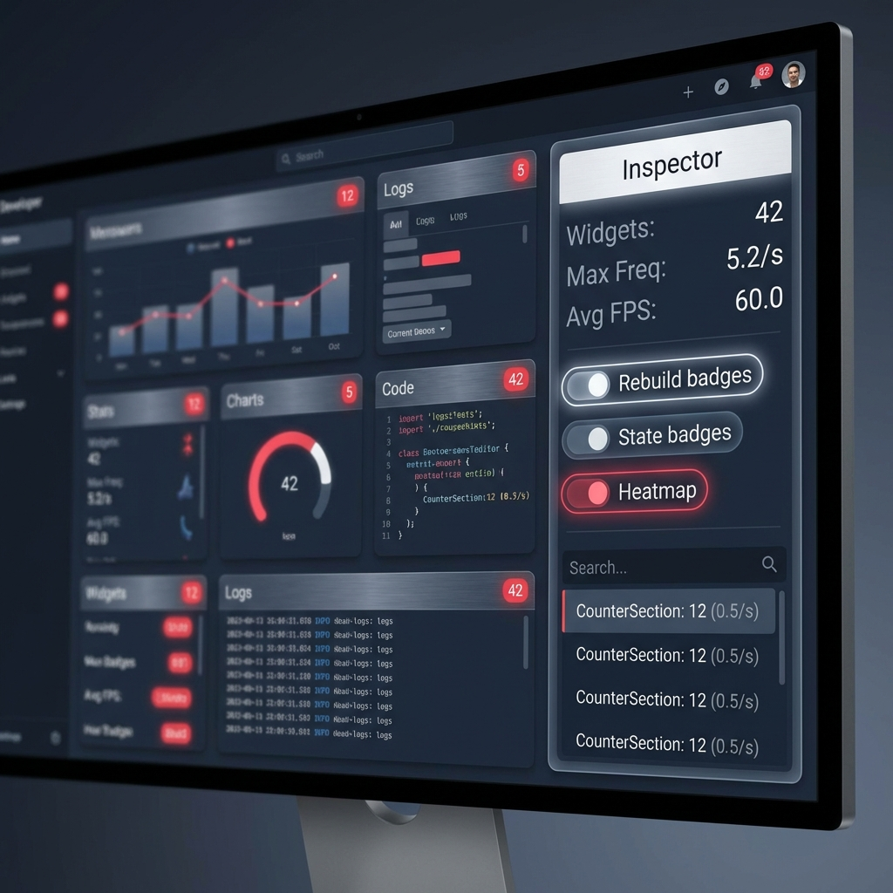
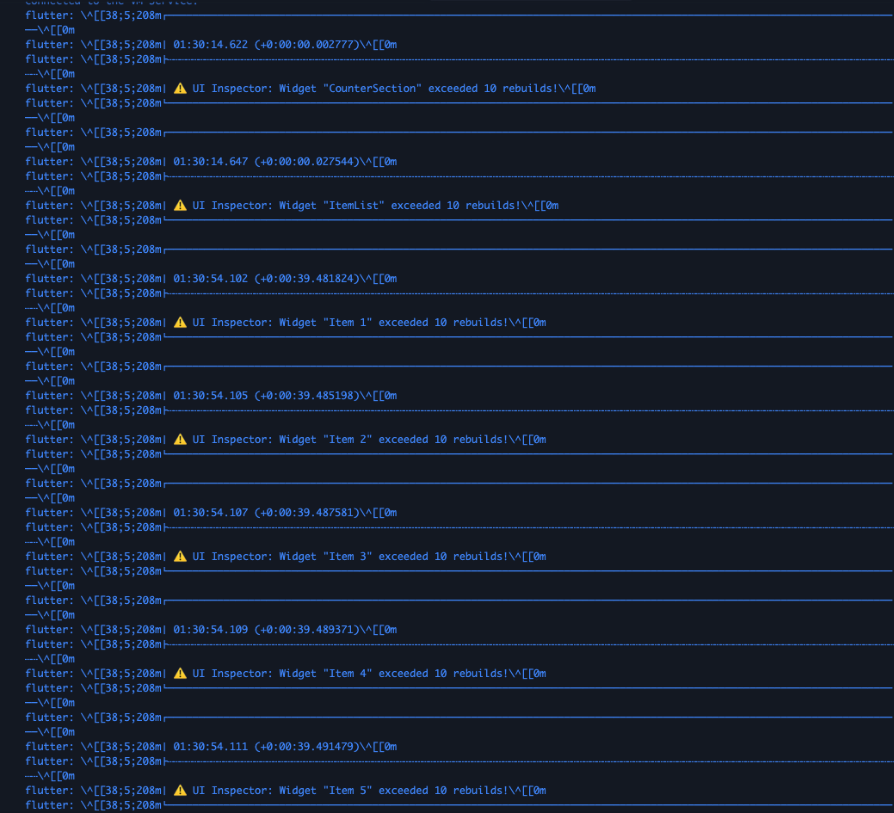

# flutter_ui_inspector

Debug-only UI inspection tools for Flutter. Inspect widget state, rebuild frequency, performance, and a floating panel without impacting release builds.



## Why

Debugging UI issues is hard when you can’t see rebuild churn or widget state transitions. This package overlays lightweight badges and tools to surface that information in debug mode only.

## Features

- **Rebuild tracking**: Badges per widget with rebuild count and **frequency stats (rebuilds/sec)**.
- **UI state badges**: Visualize state (loading, error, empty, ready) directly on widgets.
- **Draggable Inspector Panel**: Floating panel to view all tracked widgets, sort by rebuilds, and toggle settings.
- **Search & Filter**: Quickly find widgets in the inspector panel.
- **Rebuild Heatmap**: Global red vignette overlay that intensifies with rebuild frequency.
- **Performance Tracking**: Monitor FPS and jank frames.
- **Console Logging**: Auto-log warnings when widgets exceed rebuild thresholds.
- **Settings Persistence**: functionality toggles (badges, heatmap, etc.) are saved across restarts.
- **Debug-only**: logic is stripped or inactive in release mode.

## Screenshots

<table>
  <tr>
    <td width="50%">
      <strong>Main Demo</strong><br/>
      
    </td>
    <td width="50%">
      <strong>Inspector Panel & Badges</strong><br/>
      
    </td>
  </tr>
  <tr>
    <td width="50%">
      <strong>Without Inspector</strong><br/>
      
    </td>
    <td width="50%">
      <strong>With Inspector</strong><br/>
      
    </td>
  </tr>
</table>

### Console Logging



## Safety

- Guarded by `kDebugMode` and `UiInspectorConfig.enabled`
- No platform channels; Flutter-only
- Nothing activates in release mode

## Installation

```yaml
dependencies:
  flutter_ui_inspector: ^1.1.0
```

## Quick Start

### Track state + rebuilds

```dart
import 'package:flutter_ui_inspector/flutter_ui_inspector.dart';

class UserListView extends StatelessWidget {
  @override
  Widget build(BuildContext context) {
    return UiInspector(
      name: 'UserList',
      loading: true, // or from your state
      error: false,
      empty: false,
      child: ListView(children: const [Text('Item')]),
    );
  }
}
```

### Track rebuilds only

```dart
RebuildTracker(
  name: 'ProfileCard',
  child: ProfileCard(),
);
```

## Configuration

```dart
UiInspectorConfig.enabled = true;
UiInspectorConfig.showRebuildCount = true;
UiInspectorConfig.showStateBadge = true;
UiInspectorConfig.trackPerformance = false;
UiInspectorConfig.enableHeatmap = false;
UiInspectorConfig.logOnRebuildWarning = true; // Log warnings to console
UiInspectorConfig.rebuildWarningThreshold = 10;
UiInspectorConfig.jankFrameThresholdMs = 16.0;

// Initialize persistence (optional but recommended)
await UiInspectorConfig.init();
```

## Panel & Heatmap

- Call `UiInspectorPanel.enable()` in your `main()` or root widget (optional gesture: `longPress` or `tripleTap`).
- Heatmap renders inherently as a global overlay when enabled.

## Limitations

- **Debug-only**: badges/panel/heatmap are inactive in release builds.
- **Badge Geometry**: Rebuild badges are rendered inside the widget tree (Stack); they may be clipped by parents with `clipBehavior`.
- **Heatmap**: The heatmap is a global full-screen vignette, not a localized spatial heatmap per widget.
- **Frame tracking**: Requires `UiInspectorConfig.trackPerformance = true` to be enabled.

## Support

If you encounter any issues or have questions, please:

- Open an issue on [GitHub](https://github.com/HanySameh/flutter_ui_inspector/issues)
- Email: [hanysameh506@gmail.com](mailto:hanysameh506@gmail.com)
- Check existing issues for solutions
- Review the documentation above

## Show Your Support

If this package has been helpful, please consider:

- ⭐ Starring the repository on [GitHub](https://github.com/HanySameh/flutter_ui_inspector)
- 🐛 Reporting bugs or suggesting features
- 📖 Sharing with other Flutter developers
- 💬 Providing feedback and improvements

## License

MIT License (see LICENSE).

## Author

Hany Elshafey

- 📧 Email: [hanysameh506@gmail.com](mailto:hanysameh506@gmail.com)
- 🐙 GitHub: [HanySameh](https://github.com/HanySameh)
- 📱 LinkedIn: [Hany Elshafey](https://www.linkedin.com/in/hanysameh/)
