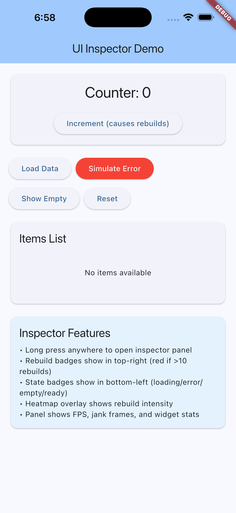
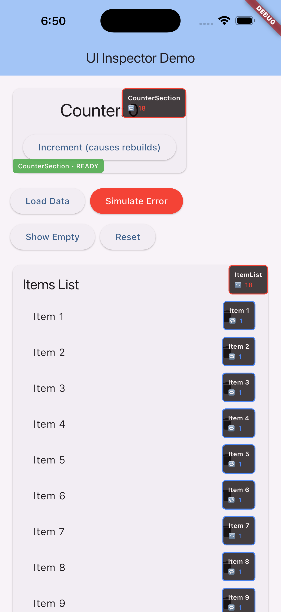
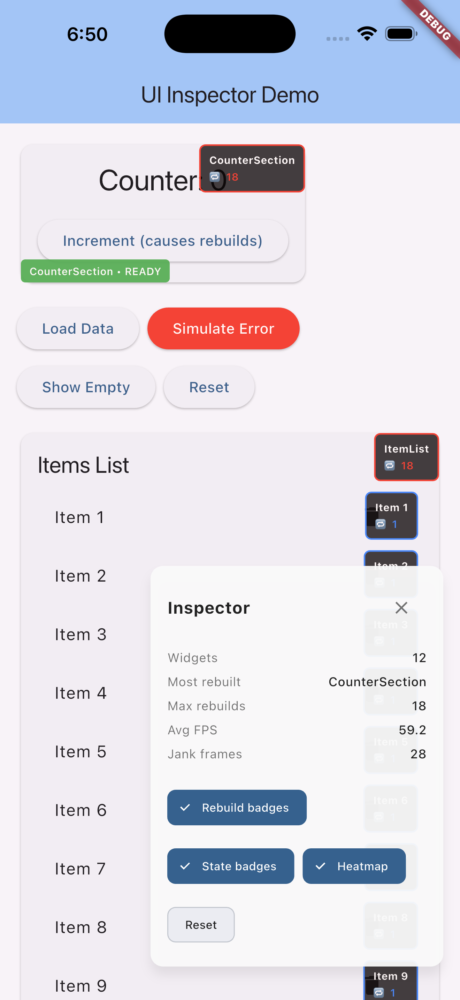

# flutter_ui_inspector

Debug-only UI inspection tools for Flutter. Inspect widget state, rebuild frequency, performance, and a floating panel without impacting release builds.

## Why

Debugging UI issues is hard when you can’t see rebuild churn or widget state transitions. This package overlays lightweight badges and tools to surface that information in debug mode only.

## Features

- Rebuild tracking badges per widget
- UI state badges (loading, error, empty, ready)
- Debug-only safety (no release impact)
- FPS / frame timing tracking
- Floating inspector panel with gesture activation
- Rebuild heatmap overlay

## Screenshots

| Without Inspector | With Inspector | Inspector Panel |
|-------------------|----------------|-----------------|
|  |  |  |

## Safety

- Guarded by `kDebugMode` and `UiInspectorConfig.enabled`
- No platform channels; Flutter-only
- Nothing activates in release mode

## Installation

```yaml
dependencies:
  flutter_ui_inspector: ^1.0.0
```

## Quick Start

### Track state + rebuilds

```dart
import 'package:flutter_ui_inspector/flutter_ui_inspector.dart';

class UserListView extends StatelessWidget {
  @override
  Widget build(BuildContext context) {
    return UiInspector(
      name: 'UserList',
      loading: true, // or from your state
      error: false,
      empty: false,
      child: ListView(children: const [Text('Item')]),
    );
  }
}
```

### Track rebuilds only

```dart
RebuildTracker(
  name: 'ProfileCard',
  child: ProfileCard(),
);
```

## Configuration

```dart
UiInspectorConfig.enabled = true;
UiInspectorConfig.showRebuildCount = true;
UiInspectorConfig.showStateBadge = true;
UiInspectorConfig.trackPerformance = false;
UiInspectorConfig.enableHeatmap = false;
UiInspectorConfig.rebuildWarningThreshold = 10;
UiInspectorConfig.jankFrameThresholdMs = 16.0;
```

## Panel & Heatmap

- Call `UiInspectorPanel.enable()` (optional gesture: `longPress` or `tripleTap`).
- Heatmap renders automatically when `UiInspectorConfig.enableHeatmap` is true.

## Limitations

- Debug-only: badges/panel/heatmap are inactive in release.
- Overlay order: badges/heatmap do not yet respect widget geometry (render as global overlays).
- Frame tracking requires `UiInspectorConfig.trackPerformance = true`.

## License

MIT License (see LICENSE).
